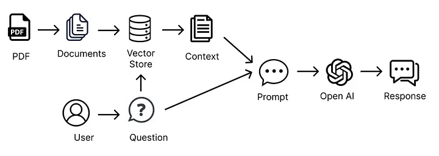
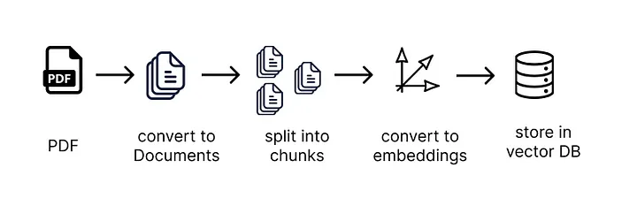

# Langchain Personal Assistant
A small project that focuses on the Lang Chain implementation of my Personal Assistant that can read data from my PDF/Resume and respond to the prompts. 

# How to Run

1. Create a `.env` file using the `dotenv_example` file as a template
2. Add your PDF/Resume to the resume directory make sure to update the `.env` with correct file name
3. Install virtual env `python -m pip install virtualenv`
4. Create Virtual Env `pythoon virtualenv venv`
5. Run `venv/Scripts/activate`
6. Run `pip install -r requirements.txt`
7. Run StreamLit `streamlit run ResumeChatUI.py`

# Workflow

 

# Embeddings and Vector Stores (Step 1)

 

```python
# Split the text using RecursiveCharacterTextSplitter
self.text_splitter = RecursiveCharacterTextSplitter(
    chunk_size=1000,
    chunk_overlap=200,
    length_function=len
)

# Generate the chunks
self.chunks = self.text_splitter.split_text(text=self.text)
self.embeddings = OpenAIEmbeddings()
self.vector_store = FAISS.from_texts(self.chunks, embedding=self.embeddings)
with open(f"{self.store_name}.pkl", "wb") as f:
    pickle.dump(self.vector_store, f)
```

Imagine you have a huge collection of different books and articles, and you want to find information related to a specific question you have. It would be quite a task to read through everything, right? That's where embeddings and vector stores come in to make things easier.

Think of embeddings as a magical tool that helps us understand the main idea of each small piece of text (like a paragraph or a sentence). It's like giving each piece of text a special label based on what it's about. This tool is called an "embedding transformer," and it's really good at figuring out the main idea of the text.

Now, imagine each piece of text is a star in the sky, and these labels are like coordinates that tell us where each star is. Stars that are close together have similar labels, meaning their ideas or topics are similar. This is how we organize our text into a "vector store," a fancy name for a place where we keep these labeled pieces of text.

When you have a question, we use another smart tool to match your question with the labels of the text pieces. This tool, called the "embeddings transformer," is like a detective. It looks for the text pieces that have the most in common with your question. We use a special method called "cosine similarity" to do this matching, which basically helps us find the closest and most relevant text pieces to your question.

Now, instead of reading every single book or article, we only look at the pieces of text that are most likely to contain the answer to your question. This is how we get around the problem of having too much information to sift through.

And the best part? If you're using a tool like LangChain, it does all this work for you. With just a few clicks, LangChain takes your question, finds the most relevant bits of text, and then uses those to help find the best answer. It's like having a super-smart librarian who can quickly find exactly what you need in a giant library!

# Interacting with the Embeddings and using Open AI

```python
self.retriever = self.vector_store.as_retriever(search_type="similarity", search_kwargs={"k": 5})
```

First, we organize all the text in a smart way using something called a vector store. Think of it as a smart filing system that knows what each piece of text is about.

Now, when you have a question, we don't throw all that text at the computer. Instead, we use the vector store to find just the pieces of text that are really about what you're asking. This way, we only use the most helpful information to get your answer.

We then give the computer a nudge by saying, "Here's the info you need to answer the question. If you're not sure about the answer, it's better to say so than to make something up."

This way, we make a neat and tidy package of information for the computer to work with, and that helps it give us a clear and accurate answer. We're using a cool tool called the ConversationalRetrievalChain chain to do this smartly, making sure we pick just enough text to get a good answer without overloading the computer. This is like hitting the sweet spot – not too much, not too little.

And that's it! We ask our question, and the computer uses just the right bits of text to come up with a good answer.

# Chat History and Memory

```python
self.memory = ConversationBufferMemory(memory_key="chat_history", return_messages=True)
self.qa = ConversationalRetrievalChain.from_llm(
    self.llm,
    self.retriever,
    verbose=True,
    combine_docs_chain_kwargs={'prompt': QA_CHAIN_PROMPT},
    condense_question_prompt=CONDENSE_QUESTION_PROMPT,
    memory=self.memory
)
```

Every time you chat with the bot, we need to remind it about the whole conversation so far. It's like showing someone your chat history to catch them up. This is because the chatbot, on its own, can't remember past talks.

There's a handy tool in LangChain that does this for us. It's called the ConversationalRetrievalChain and Memory, and it allows us to include our past chats every time we talk to the bot. This way, the chatbot can follow along with the conversation as if it remembers everything.

So, we set up a new chatbot script that's ready to keep the conversation flowing. We make sure it's prepared with all the information it needs, just like before, but this time it can also hold onto the conversation history.

When you're ready to chat, it's like talking in a messaging app on your computer. You type your message, and if you want to stop, you just type "exit." Each time you chat, the bot saves the conversation. So, when you start talking again, it knows exactly where you left off. This way, the chatbot gets better at helping you out because it 'remembers' what you've already talked about.

To get this going, you just run the chatbot script, and you're ready to start a conversation that the bot will remember. If you want to start over, just clear the chat history, and it's like meeting the chatbot for the first time again.

---
# Conclusion

There we have it! our own little AI Assistant working with our data to give us answers to the questions we need.